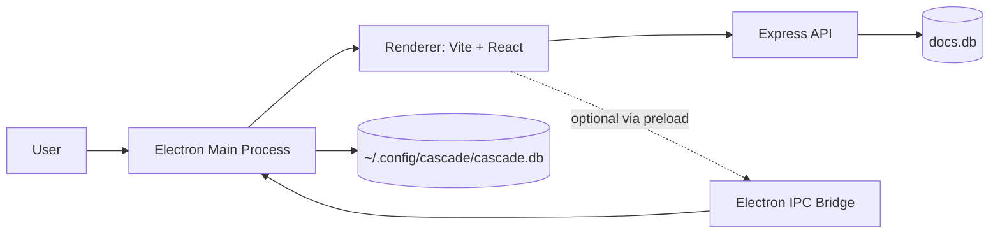

# Architecture

This repository is a compact desktop-plus-web document system with three runtime layers:

1. A TypeScript Express API server.
2. A React client served by Vite.
3. An Electron shell that hosts the client and exposes local database IPC.

The current codebase is intentionally minimal after cleanup and keeps only launch-path code.

## System Topology

## Runtime Components

### 1) Backend API

- Entry: [index.ts](../index.ts)
- Stack: Express + better-sqlite3 + account/session middleware
- Data store: SQLite file at `DOCS_DB_PATH` or workspace-local [docs.db](../docs.db)

Primary responsibilities:

- User registration and login.
- Session validation middleware.
- CRUD for documents.
- Per-user sidebar ordering.
- Write-access rule: only document creator can edit/delete.

### 2) Frontend Renderer

- HTML entry: [client/app.html](../client/app.html)
- JS entry: [client/src/main.tsx](../client/src/main.tsx)
- Main app: [client/src/App.tsx](../client/src/App.tsx)
- Build/runtime config: [client/vite.config.js](../client/vite.config.js)

Primary responsibilities:

- Account flow (register/login/logout).
- Document list browsing and selection.
- Document editing and persistence.
- Sidebar reorder UX with server persistence.

### 3) Electron Host

- Main process: [cascade-electron/main.cjs](../cascade-electron/main.cjs)
- Preload bridge: [cascade-electron/preload.cjs](../cascade-electron/preload.cjs)
- Local DB module: [cascade-electron/database.cjs](../cascade-electron/database.cjs)

Primary responsibilities:

- Create desktop window and load app URL.
- Restrict navigation/window-open to trusted hosts.
- Provide keyboard shortcuts (reload, relaunch, zoom).
- Initialize local netdoc database in user config directory.

## Data Boundaries

There are two separate SQLite stores:

- API database: [docs.db](../docs.db) managed in [index.ts](../index.ts).
- Electron local database: managed in [cascade-electron/database.cjs](../cascade-electron/database.cjs), defaulting to `~/.config/cascade/cascade.db`.

These databases currently serve different concerns:

- API DB powers the document editor used by the React UI.
- Electron DB powers netdoc-related IPC methods exposed via preload.

## Runtime Boundary Model

- API access is scoped by account/session checks in middleware.
- Renderer process runs with `contextIsolation: true` and `nodeIntegration: false` in Electron.
- Navigation policy blocks external navigation and popup creation outside allowlisted hosts.

## Request and Event Flow

### App launch (dev)

1. Root script starts API and Vite dev server.
2. Electron starts and loads `http://localhost:5173`.
3. Renderer boots React app and starts account/doc API calls.

### Document save

1. User edits local draft in React state.
2. Renderer sends `PATCH /api/docs/:id`.
3. API validates ownership and updates row.
4. Renderer refreshes active doc + list.

## Notes for Future Contributors

- The project still contains dependency declarations that are not used by the minimal launch path.
- Some package scripts reference files that were part of the removed legacy tree.
- Treat [index.ts](../index.ts), [client/src/App.tsx](../client/src/App.tsx), and [cascade-electron/main.cjs](../cascade-electron/main.cjs) as the canonical runtime spine.
