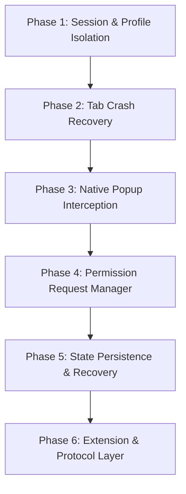

# Roadmap: Evolving Cascade into a Production-Grade Browser

This document outlines the architectural phases and implementation details required to evolve Cascade from an embedded wrapper into a robust, secure, multi-process web browser built on Electron.

---

## Architectural Objectives
1. **Process and Session Isolation**: Separate third-party web content from Cascade's core UI and other tabs.
2. **Fault Tolerance**: Prevent single-tab crashes or freezes from impacting the application shell.
3. **Strict Security Model**: Restrict permission request grants and enforce absolute Chromium-level sandboxing.
4. **State Persistence**: Preserve browser history, navigation stacks, and cookies across restarts safely.

---

## Roadmap Phases



---

### Phase 1: Session & Profile Isolation
Currently, Cascade uses a single global partition (`persist:webview`). This shares cache, database instances, and cookies across all tabs.

#### Technical Goals
* **Multi-Profile Support**: Implement a Session Manager that maps tabs to specific profiles (e.g., `persist:profile-personal`, `persist:profile-work`).
* **Incognito/Private Browsing**: For private tabs, generate in-memory partitions on-the-fly (`webview-temp-${crypto.randomUUID()}`). Ensure these sessions do not write to disk and are completely garbage-collected upon tab destruction.

#### Key API Hooks
* `session.fromPartition(partitionName)`
* `session.cookies.flushStore()`

---

### Phase 2: Tab Crash Recovery & Process Monitoring
Websites are untrusted and prone to memory leaks. A single tab crash should not render Cascade blank or freeze the application.

#### Technical Goals
* **Crash Detection**: Monitor individual tab lifecycles for unexpected terminations.
* **Aw-Snap Fallback**: When a tab crashes, keep the React tab metadata intact, but switch the view area to an overlay showing a reload option.
* **Granular Process Control**: Implement manual tab reload/kill functionality.

#### Key API Hooks
```javascript
view.webContents.on('render-process-gone', (event, details) => {
  const { reason, exitCode } = details;
  console.error(`Tab process gone: Reason: ${reason}, Exit Code: ${exitCode}`);
  // Dispatch IPC message back to renderer to show crash screen
  eventSender.send('browser:event', { tabId, type: 'crashed', reason });
});
```

---

### Phase 3: Sandbox Enforcement & Native Popup Interception
To secure Cascade, third-party code must have zero access to the operating system or raw IPC handlers. Popups should open in tabs instead of spawning new OS windows.

#### Technical Goals
* **Strict Sandboxing**: Enforce `sandbox: true` and `contextIsolation: true` in `webPreferences`.
* **Zero-Trust Preload**: Ensure `preload.cjs` does not leak Node module loaders or privileged IPC channels to the client script.
* **Popup Redirection**: Intercept `window.open` or `target="_blank"` and redirect them to open as new tabs within the React layout grid.

#### Key API Hooks
```javascript
view.webContents.setWindowOpenHandler(({ url }) => {
  // Discard default window creation
  // Send IPC message to parent window to create a new tab instead
  eventSender.send('browser:event', { type: 'new-tab', url });
  return { action: 'deny' };
});
```

---

### Phase 4: Permission Request Manager
Currently, Cascade auto-approves all device/capability requests. We must implement user-facing prompts for security.

#### Technical Goals
* **Consent Interception**: Trap incoming permission requests in the main process (camera, microphone, geolocation, notifications).
* **Asynchronous Prompting**: Send an IPC event to the React app shell to show a browser-like popup near the address bar. Block the Chromium handler callback until the user selects **Allow** or **Deny**.
* **Domain Whitelisting**: Store user choices persistently in SQLite so users aren't prompted on every visit.

#### Key API Hooks
```javascript
webviewSession.setPermissionRequestHandler((webContents, permission, callback, details) => {
  const requestingUrl = details.requestingUrl;
  // 1. Check sqlite config database for existing grant
  // 2. If no grant exists, trigger React UI prompt via IPC
  // 3. Resolve callback(true / false) based on prompt result
});
```

---

### Phase 5: State Persistence & Recovery
A browser must survive application crashes and clean quits by offering back/forward history navigation and session restore.

#### Technical Goals
* **Navigation Database**: Log tab URLs, document titles, scroll offsets, and active states to `cascade.db` on successful navigation events.
* **Crash-Resilient Startup**: Offer to restore the last open layout panes and websites if Cascade was closed unexpectedly.
* **Navigation History Panel**: Expose an IPC API to query and search chronological navigation records.

#### Key API Hooks
* `view.webContents.on('did-navigate', ...)`
* `view.webContents.on('did-navigate-in-page', ...)`

---

### Phase 6: Extension & Custom Protocol Layer
To support standard productivity workflows, Cascade needs adblocking customizability and the ability to load extension scripts.

#### Technical Goals
* **Custom Protocols**: Implement a custom origin scheme (`cascade://`) to serve internal notes, local terminals, and settings pages securely.
* **Extension Bridge**: Interface with `session.loadExtension` to support user-installed Chrome extensions, mapping background tasks and content scripts.

#### Key API Hooks
* `protocol.registerSchemesAsPrivileged`
* `protocol.handle`
* `session.loadExtension`
