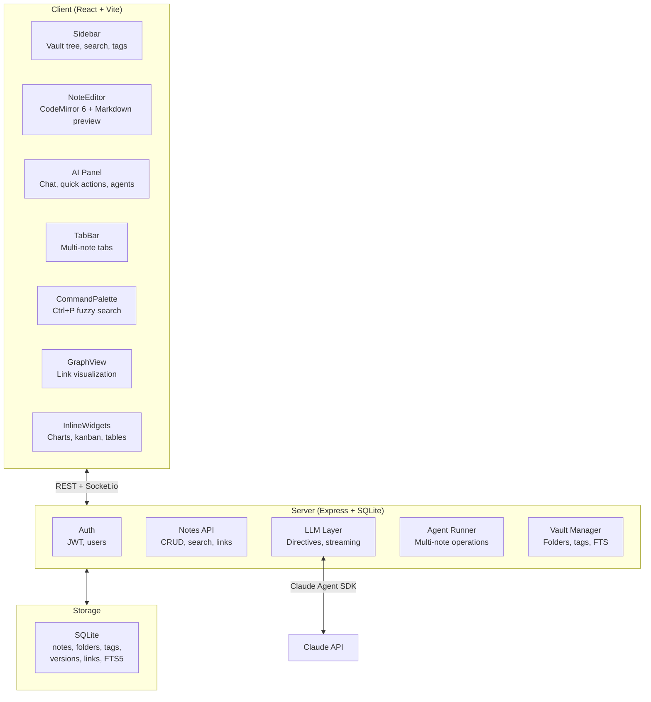

# Cascade Notes — Intelligent LLM-Powered Notes App

Transform the existing Cascade spec-browser into an **Obsidian-style notes app with inline LLM directives** — where you write notes in Markdown, but can also prompt models *inside* the notes to generate content, search across your vault, create inline widgets, and more.

## User Review Required

> [!IMPORTANT]
> **LLM Provider Strategy**: The current codebase uses `@anthropic-ai/claude-agent-sdk` with Claude Sonnet. Should we:
> - Keep Claude-only (simplest, already wired up)?
> - Support multiple providers via API keys (OpenAI, Gemini, Anthropic) with a settings UI?
> - Use a unified SDK like Vercel AI SDK to abstract providers?

> [!IMPORTANT]
> **Storage Model**: Obsidian stores notes as local `.md` files in a vault directory. The current app uses SQLite for docs. Should we:
> - **File-backed** (like Obsidian) — notes are real `.md` files on disk, SQLite only for indexes/metadata?
> - **DB-backed** — notes live in SQLite, exportable to `.md`?
> - File-backed is more Obsidian-like and lets users use git, other editors, etc. DB-backed is simpler and avoids file-watching complexity.

> [!IMPORTANT]
> **Electron vs. Web**: The app currently has an Electron shell. Should we:
> - Keep Electron as the primary target (true local app, file system access)?
> - Go web-first with Electron as optional wrapper?
> - The LLM directive features work better with a server backend either way.

## Open Questions

> [!WARNING]
> **Inline LLM Directive Syntax** — What should the prompt syntax look like inside notes? Some options:
> 1. **Slash commands**: `/ask What are the key themes in my meeting notes?` 
> 2. **Block directives**: ` ```llm\nSummarize the above section\n``` `
> 3. **Inline markers**: `{{ai: expand this bullet list into prose}}`
> 4. **Hybrid** — slash commands for quick actions, block directives for complex prompts
>
> I'm leaning toward **option 4 (hybrid)** — it's the most flexible and feels natural in Markdown. Thoughts?

> [!NOTE]
> **Widget System Scope** — "Inline widgets" could mean many things. For v1, I'm proposing:
> - Embedded charts/tables generated by LLM
> - Kanban boards from task lists
> - Embedded note transclusions (`![[other-note]]`)
> - Calendar/timeline views from date-tagged notes
>
> Which of these matter most to you? Or do you have other widget ideas?

---

## Proposed Changes

The transformation is organized into 5 phases. Each phase is independently shippable.

---

### Phase 1: Core Notes Infrastructure (Foundation)

Strip the spec-browser specifics and establish the notes data model, vault system, and basic CRUD.

#### [MODIFY] [index.ts](file:///home/jt/Desktop/cascade/index.ts)
- Remove spec-browser routes (`/api/specs`, `/api/runs`, `/api/workspaces/:id/rescan`, etc.)
- Remove legacy doc routes (`/api/docs` CRUD, `/api/sidebar/reorder`)
- Add new routes:
  - `GET/POST /api/vaults` — list/create vaults (renamed from workspaces)
  - `GET/POST /api/vaults/:id/notes` — list/create notes
  - `GET/PUT/DELETE /api/notes/:id` — note CRUD
  - `GET/POST /api/folders` — folder management
  - `POST /api/notes/:id/move` — move note to folder
  - `GET /api/search` — full-text search across vault
  - `GET /api/notes/:id/backlinks` — find notes linking to this one
  - `GET /api/notes/:id/versions` — version history
- Replace DB schema: new tables for `vaults`, `notes`, `folders`, `tags`, `note_tags`, `note_links`
- Keep: auth system, JWT middleware, socket.io infrastructure, health endpoint

**New DB Schema:**
```sql
-- Vaults (evolved from workspaces)
CREATE TABLE vaults (
  id TEXT PRIMARY KEY,
  name TEXT NOT NULL,
  root_path TEXT,          -- NULL if DB-backed, path if file-backed
  created_by INTEGER REFERENCES users(id),
  created_at TEXT DEFAULT (datetime('now'))
);

-- Folders (tree structure)
CREATE TABLE folders (
  id TEXT PRIMARY KEY,
  vault_id TEXT REFERENCES vaults(id),
  parent_id TEXT REFERENCES folders(id),
  name TEXT NOT NULL,
  position INTEGER DEFAULT 0,
  created_at TEXT DEFAULT (datetime('now'))
);

-- Notes
CREATE TABLE notes (
  id TEXT PRIMARY KEY,
  vault_id TEXT REFERENCES vaults(id),
  folder_id TEXT REFERENCES folders(id),
  title TEXT NOT NULL,
  content TEXT DEFAULT '',
  content_preview TEXT DEFAULT '',   -- first ~200 chars for list view
  is_pinned INTEGER DEFAULT 0,
  is_archived INTEGER DEFAULT 0,
  word_count INTEGER DEFAULT 0,
  created_by INTEGER REFERENCES users(id),
  created_at TEXT DEFAULT (datetime('now')),
  updated_at TEXT DEFAULT (datetime('now'))
);

-- Tags
CREATE TABLE tags (
  id TEXT PRIMARY KEY,
  vault_id TEXT REFERENCES vaults(id),
  name TEXT NOT NULL,
  color TEXT,
  UNIQUE(vault_id, name)
);

CREATE TABLE note_tags (
  note_id TEXT REFERENCES notes(id) ON DELETE CASCADE,
  tag_id TEXT REFERENCES tags(id) ON DELETE CASCADE,
  PRIMARY KEY (note_id, tag_id)
);

-- Wikilinks / backlinks index
CREATE TABLE note_links (
  source_id TEXT REFERENCES notes(id) ON DELETE CASCADE,
  target_id TEXT REFERENCES notes(id) ON DELETE CASCADE,
  target_title TEXT,        -- for unresolved links
  context TEXT,             -- surrounding text snippet
  PRIMARY KEY (source_id, target_id)
);

-- Version history (evolved from spec_versions)
CREATE TABLE note_versions (
  id TEXT PRIMARY KEY,
  note_id TEXT REFERENCES notes(id) ON DELETE CASCADE,
  content TEXT NOT NULL,
  label TEXT,               -- 'manual', 'auto', 'ai-edit', 'pre-ai'
  created_at TEXT DEFAULT (datetime('now'))
);

-- Full-text search
CREATE VIRTUAL TABLE notes_fts USING fts5(
  title, content, content='notes', content_rowid='rowid'
);
```

#### [MODIFY] [server/workspace.ts](file:///home/jt/Desktop/cascade/server/workspace.ts) → rename to `server/vault.ts`
- Repurpose workspace logic into vault management
- Add folder tree CRUD operations
- Add note CRUD with automatic link extraction (parse `[[wikilinks]]`)
- Add full-text search index maintenance (FTS5 triggers)
- Remove: spec scanning, frontmatter parsing, file watching

#### [MODIFY] [server/versions.ts](file:///home/jt/Desktop/cascade/server/versions.ts)
- Keep the LCS diff algorithm — it's great for note version comparison
- Add auto-versioning: snapshot on save if content changed significantly (debounced)
- Add `label` support for AI-generated edits (`'pre-ai'` snapshot before LLM modifies)

#### [DELETE] [server/threads.ts](file:///home/jt/Desktop/cascade/server/threads.ts)
- Remove spec-anchored threads (not needed for v1; could revisit as note comments later)

---

### Phase 2: Rich Markdown Editor

Replace the basic textarea with a proper editor that supports live preview, wikilinks, and the foundation for LLM directives.

#### [MODIFY] [client/src/components/SpecEditor.tsx](file:///home/jt/Desktop/cascade/client/src/components/SpecEditor.tsx) → rename to `NoteEditor.tsx`
- **Major rewrite** — this becomes the core of the app
- Implement a **WYSIWYG live-preview editor** (like Obsidian's Live Preview mode) using **CodeMirror 6**:
  - Markdown renders **inline as you type** — `**bold**` shows as **bold**, `# Heading` renders at heading size, `[[links]]` become clickable, images render in place, etc.
  - When the cursor enters a formatted region, it reveals the raw Markdown syntax for editing; when the cursor leaves, it collapses back to rendered form
  - No separate preview pane — the editor *is* the preview
  - Custom CodeMirror decorations/widgets for:
    - Heading size rendering (h1–h6)
    - Inline bold/italic/code styling
    - Wikilink rendering with hover preview
    - Image & embed previews
    - Checkbox interactivity (`- [ ]` / `- [x]`)
    - Code block syntax highlighting
    - LLM directive blocks (`{{ai:}}`, ` ```llm `, ` ```agent `) rendered as styled interactive widgets
  - Wikilink autocompletion (`[[` triggers note search dropdown)
  - Tag autocompletion (`#` triggers tag list)
  - Vim keybindings (optional, toggle in settings)
- Keyboard shortcuts: `Ctrl+S` save, `Ctrl+B` bold, `Ctrl+I` italic, `Ctrl+K` link, `Ctrl+Shift+F` vault search
- Toolbar: formatting buttons, insert link, insert image, insert LLM directive block
- Status bar: word count, character count, last saved time, reading time estimate

#### [MODIFY] [client/src/components/SpecTree.tsx](file:///home/jt/Desktop/cascade/client/src/components/SpecTree.tsx) → rename to `Sidebar.tsx`
- **Vault explorer** (top section):
  - Vault selector dropdown
  - Folder tree with expand/collapse, drag-to-reorder, right-click context menu
  - Note items within folders showing title + preview snippet + tags
  - "New Note" / "New Folder" buttons
  - Pin notes to top
- **Quick actions** (middle section):
  - 🔍 Search (opens search overlay — `Ctrl+Shift+F`)
  - 📊 Graph view (link graph visualization)
  - 🏷️ Tags browser
  - 🗂️ Recent notes
  - 🗑️ Trash (archived notes)
- **Collapsible** with `Ctrl+\` toggle
- Drag-and-drop notes between folders

#### [NEW] `client/src/components/SearchOverlay.tsx`
- Modal overlay for vault-wide search
- Full-text search with result highlighting and context snippets
- Filter by: folder, tags, date range, has-AI-content
- Keyboard navigable (arrow keys + enter to open)
- Triggered by `Ctrl+Shift+F` or sidebar button

#### [NEW] `client/src/components/GraphView.tsx`
- Force-directed graph visualization of note links (using D3.js or a lightweight alternative)
- Nodes = notes, edges = wikilinks
- Click node to navigate to note
- Zoom, pan, filter by folder/tag
- Highlight current note and its connections

#### [MODIFY] [client/src/components/DiffView.tsx](file:///home/jt/Desktop/cascade/client/src/components/DiffView.tsx)
- Keep as-is — useful for version history comparison
- Minor styling updates to match new theme

---

### Phase 3: LLM Directive System (The Core Innovation)

This is what makes Cascade Notes different from Obsidian. Users embed LLM directives in their notes, and the app executes them.

#### [NEW] `server/llm.ts` — LLM Orchestration Layer
- **Provider abstraction**: interface for calling LLMs, initially backed by Claude Agent SDK
- **Directive parser**: extract LLM directives from note content
- **Context builder**: assembles context for each directive (current note, linked notes, vault search results)
- **Streaming support**: stream LLM responses back to client via socket.io
- **Tool definitions** the LLM can use:
  - `search_vault(query)` — full-text search across all notes
  - `read_note(title_or_id)` — read another note's content
  - `create_note(title, content, folder?)` — create a new note
  - `update_note(id, content)` — modify an existing note
  - `list_notes(folder?, tag?)` — list notes with filters
  - `create_widget(type, data)` — generate an inline widget (chart, table, kanban)

#### [NEW] `server/directives.ts` — Directive Types & Parsing
Supported directive types:

**1. Inline Ask** — quick question/generation
```markdown
{{ai: summarize the above 3 paragraphs into bullet points}}
```
→ LLM replaces the directive with generated content, keeping a `<!-- ai-generated -->` comment for attribution.

**2. Block Directive** — complex, multi-step prompts
````markdown
```llm
Using my meeting notes from this week (search for "meeting" + "2024"),
create a summary document with action items organized by person.
Create it as a new note called "Weekly Action Items - Week 48".
```
````
→ LLM executes with tool access, can search vault, create notes, etc. Output streams below the block.

**3. Slash Commands** — quick actions in the editor
- `/ask [question]` — ask about current note or vault
- `/summarize` — summarize current note
- `/expand` — expand selected text into longer prose
- `/rewrite [instruction]` — rewrite selected text
- `/link` — find related notes and suggest wikilinks
- `/tags` — suggest tags for current note
- `/translate [language]` — translate selected text
- `/todo` — extract action items from current note

**4. Agent Mode** — long-running multi-note operations
```markdown
```agent
Review all my notes tagged #project-alpha and create a 
comprehensive project status document. Cross-reference with 
notes tagged #meeting for any blockers mentioned.
```
```
→ Runs as a background agent (reusing the existing runner infrastructure), with progress shown in the AI panel.

#### [MODIFY] [server/runner.ts](file:///home/jt/Desktop/cascade/server/runner.ts)
- Refactor from spec-reconciliation to **note-aware agent runner**
- Remove git worktree logic
- Keep: Claude Agent SDK integration, streaming events, socket.io broadcasting
- New system prompt focused on note operations (search, create, link, summarize)
- Agent tools become vault-aware (search, read, create, update notes)

#### [NEW] `client/src/components/AIPanel.tsx` (replaces AgentPanel.tsx)
- **Quick actions bar**: buttons for Summarize, Expand, Find Related, Suggest Tags
- **Chat interface**: conversational interaction with the LLM about your notes
  - Ask questions about your vault
  - Request note generation
  - Get writing suggestions
- **Active operations**: show running directives/agents with progress
- **History**: past AI interactions with this note
- **Context indicator**: shows what notes/content the LLM can "see"

#### [NEW] `client/src/components/DirectiveBlock.tsx`
- Rendered inline in the note preview
- Shows directive source (collapsed), output (expanded), and status (pending/streaming/done/error)
- "Re-run" button to regenerate
- "Accept" to replace directive with output, "Edit" to modify prompt
- Streaming animation while LLM is generating

#### [NEW] `client/src/components/InlineWidget.tsx`
- Renders LLM-generated widgets inline in the preview:
  - **Table**: structured data as a sortable table
  - **Chart**: bar/line/pie charts (using a lightweight chart lib)
  - **Kanban**: task board from `- [ ]` items
  - **Timeline**: chronological events from date-annotated items
  - **Mermaid diagram**: rendered mermaid blocks
- Widgets are interactive (sort, filter, drag) but data is serialized back to Markdown

---

### Phase 4: UI/UX Overhaul

Transform the visual design from a dev tool to a premium writing environment.

#### [NEW] `client/src/index.css` — Design System
- **Color palette**: Warm dark theme inspired by Obsidian
  - Background: `hsl(220, 15%, 8%)` → `hsl(220, 12%, 12%)` gradient
  - Surface: `hsl(220, 12%, 14%)` with subtle glassmorphism
  - Accent: `hsl(270, 65%, 65%)` (purple) — for AI-generated content
  - Text: `hsl(40, 20%, 90%)` (warm white)
  - Borders: `hsl(220, 10%, 20%)` with 1px subtle lines
- **Typography**: Inter for UI, JetBrains Mono for editor, serif option for reading mode
- **Animations**: 
  - Smooth sidebar expand/collapse (200ms ease)
  - Note switching crossfade
  - LLM streaming text cursor blink
  - Widget entrance animations
  - Hover glow effects on interactive elements
- **Glassmorphism**: frosted glass panels with `backdrop-filter: blur()`
- CSS custom properties for full theme customization

#### [MODIFY] [client/src/App.tsx](file:///home/jt/Desktop/cascade/client/src/App.tsx)
- New layout: `Sidebar | NoteEditor | AIPanel` (same 3-pane but redesigned)
- Sidebar and AI panel independently collapsible
- Add command palette (`Ctrl+P`) for quick note switching and actions
- Add tabbed notes (multiple notes open simultaneously)
- Keyboard-driven navigation throughout
- Settings modal for:
  - Theme (dark/light/custom)
  - Editor preferences (font size, line height, vim mode)
  - LLM settings (API key, model, temperature)
  - Vault configuration

#### [NEW] `client/src/components/CommandPalette.tsx`
- `Ctrl+P` opens fuzzy-search overlay for notes, commands, and actions
- Type to search: notes by title, `>` prefix for commands, `#` for tags
- Recent items shown by default
- Keyboard navigation (arrow keys + enter)

#### [NEW] `client/src/components/TabBar.tsx`
- Horizontal tab bar above the editor
- Open multiple notes as tabs
- Drag to reorder, middle-click to close
- Tab context menu: close others, close to right, pin tab
- Modified indicator (dot) for unsaved changes

#### [DELETE] [client/src/components/AgentPanel.tsx](file:///home/jt/Desktop/cascade/client/src/components/AgentPanel.tsx)
- Replaced by `AIPanel.tsx`

#### [DELETE] [client/src/components/SpecEditor.tsx](file:///home/jt/Desktop/cascade/client/src/components/SpecEditor.tsx)
- Replaced by `NoteEditor.tsx`

#### [DELETE] [client/src/components/SpecTree.tsx](file:///home/jt/Desktop/cascade/client/src/components/SpecTree.tsx)
- Replaced by `Sidebar.tsx`

---

### Phase 5: Polish & Advanced Features

#### [NEW] `client/src/components/VersionHistory.tsx`
- Timeline view of note versions
- Side-by-side diff comparison
- Restore to any previous version
- AI-generated version labels tagged

#### [MODIFY] [client/src/api.ts](file:///home/jt/Desktop/cascade/client/src/api.ts)
- Update TypeScript types for new data model (Note, Folder, Tag, Vault, Directive, Widget)
- Add API functions for all new endpoints
- Add types for socket.io events (directive streaming, agent progress)

#### [MODIFY] [client/src/socket.ts](file:///home/jt/Desktop/cascade/client/src/socket.ts)
- Add namespaces/rooms for:
  - `directive:<noteId>` — streaming LLM directive output
  - `agent:<runId>` — background agent progress
  - `vault:<vaultId>` — note changes (for multi-window sync)

#### Cleanup — Remove Dead Dependencies
From `package.json`, remove:
- `@prisma/client`, `prisma`, `pg` (unused PostgreSQL)
- `@google-cloud/storage` (unused)
- `plugin-react` (placeholder package)

Add new dependencies:
- `@codemirror/view`, `@codemirror/state`, `@codemirror/lang-markdown` — editor
- `@codemirror/autocomplete` — wikilink/tag completion
- `d3` or `force-graph` — graph view
- `chart.js` or `recharts` — inline chart widgets

---

## Architecture Summary



---

## Verification Plan

### Automated Tests
- `curl` smoke tests for all API endpoints (auth, vault CRUD, note CRUD, search)
- Verify FTS5 search returns correct results
- Verify wikilink parsing and backlink indexing
- Verify LLM directive parsing extracts correct directive types

### Manual Verification
- Create a vault, add folders, create notes with Markdown
- Test wikilinks: `[[note title]]` creates links, backlinks appear
- Test LLM directives: inline `{{ai:}}`, block ` ```llm `, slash commands
- Test search: full-text search across vault with result highlighting
- Test version history: save, edit, view diff, restore
- Test graph view: nodes and edges match actual note links
- Test UI responsiveness: sidebar collapse, panel toggle, keyboard shortcuts
- Test tab management: open multiple notes, switch, close, reorder
