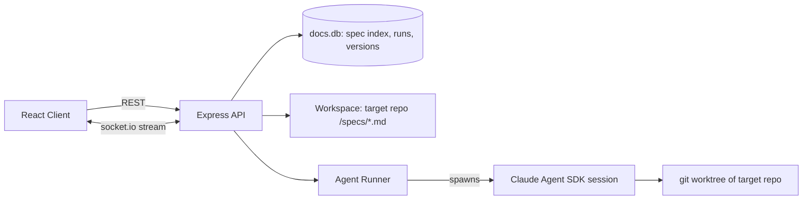

# Proposed: Spec-Browser for AI-Assisted Work

Goal: evolve Cascade from a generic document editor into a **spec browser** — a tool where plaintext implementation specs are the high-level language for software design. Users read/edit specs, then dispatch agents to make a target codebase conform to them, reviewing results like the VS Code agents panel.

## Guiding Principles

1. **Files are canonical, DB is an index.** Specs live as Markdown files in a git-tracked `specs/` folder of the *target project*, not locked in SQLite. The existing `docs.db` becomes a cache/index for browsing, search, and metadata. This keeps specs versionable, diffable, and editable outside the app.
2. **Spec diff = agent prompt.** The unit of work is "the spec changed from A to B; make the code match." Version snapshots of specs are first-class.
3. **Reuse the existing spine.** Express API ([index.ts](../index.ts)), React client ([client/src/App.tsx](../client/src/App.tsx)), socket.io (already a dependency), and the sidebar/editor UX all carry over. Electron netdoc IPC stays unused.

## System Topology



## New Concepts & Data Model

Add tables to `docs.db` (keep existing users/sessions/docs tables untouched):

- `workspaces(id, name, repo_path, specs_dir, created_by)` — a registered target project. `specs_dir` defaults to `<repo_path>/specs`.
- `specs(id, workspace_id, rel_path, title, status, updated_at)` — index row per spec file. `status ∈ {draft, ready, implementing, implemented, stale}`.
- `spec_versions(id, spec_id, content, created_at, label)` — full-content snapshots. Snapshot on: explicit save, and automatically right before each agent run (so the run records exactly what it implemented).
- `runs(id, spec_id, base_version_id, head_version_id, status, branch_name, started_at, finished_at, summary)` — `status ∈ {queued, running, awaiting_review, merged, discarded, failed}`.
- `run_events(id, run_id, seq, type, payload_json, ts)` — persisted stream of agent events (text, tool_use, file_edit, error) so runs are replayable after reload.

### Spec file format

Markdown with YAML frontmatter:

```markdown
---
id: auth-sessions          # stable slug, matches specs.id
status: ready
targets: [index.ts, client/src/App.tsx]   # optional hints, not constraints
depends: [data-model]      # other spec ids
---
# Session Handling
Sessions expire after 30 days...
```

The API parses frontmatter on index; the body is free prose. No DSL — the philosophy is plain language, with frontmatter only for routing/metadata.

## Backend Modules (new files, keep index.ts as the mount point)

1. **`server/workspace.ts`** — register a workspace, scan `specs_dir` recursively, upsert `specs` rows, watch for external file changes (chokidar or `fs.watch`) and re-index. Reads/writes spec files; every save from the UI writes the file *and* updates the index row.
2. **`server/versions.ts`** — snapshot/list/diff spec versions. Diffing uses plain unified text diff (e.g. the `diff` npm package).
3. **`server/runner.ts`** — the agent runner:
   - On run start: snapshot spec → create `runs` row → `git worktree add` a temp worktree on a new branch `spec/<spec-id>/<run-id>` → spawn an agent session via **`@anthropic-ai/claude-agent-sdk`** (`query()` with `cwd` = worktree, `permissionMode: 'acceptEdits'`).
   - Prompt construction: system context ("You implement specs; the spec is the source of truth") + full current spec body + unified diff vs. the last *implemented* version (or "new spec" if none) + paths of related specs from `depends`.
   - Pipe SDK message stream → persist to `run_events` → broadcast on socket.io room `run:<id>`.
   - On agent completion: `git diff` the worktree vs. base, store summary, set `awaiting_review`.
   - Review actions: **merge** (commit in worktree, merge branch into base or leave branch for the user) or **discard** (`git worktree remove`, delete branch). On merge, mark spec `implemented` and pin `head_version_id`.
   - Concurrency: one running agent per spec; queue beyond that. Multiple specs may run in parallel (separate worktrees make this safe).
4. **Routes** added in [index.ts](../index.ts), all behind the existing session middleware:
   - `GET/POST /api/workspaces`, `POST /api/workspaces/:id/rescan`
   - `GET /api/workspaces/:id/specs`, `GET/PUT /api/specs/:id` (PUT writes file + snapshots)
   - `GET /api/specs/:id/versions`, `GET /api/specs/:id/diff?from=&to=`
   - `POST /api/specs/:id/runs` (start), `GET /api/runs/:id`, `GET /api/runs/:id/events`, `GET /api/runs/:id/diff`
   - `POST /api/runs/:id/merge`, `POST /api/runs/:id/discard`, `POST /api/runs/:id/message` (send a follow-up instruction to a live session)
- Socket.io namespace `/runs`: client joins `run:<id>`, receives `event` (mirrors `run_events`) and `status` messages.

## Client (extend [client/src/App.tsx](../client/src/App.tsx), then split into components)

Three-pane layout, evolving the current sidebar+editor:

1. **Left — spec tree.** Existing sidebar, now grouped by workspace and showing per-spec status badges (draft/ready/implementing/implemented/stale). Reuse existing reorder persistence.
2. **Center — spec editor.** Existing title/body editor; add a preview toggle (`react-markdown` is already installed), a frontmatter strip rendered as form fields (status, targets, depends), and a version history dropdown with side-by-side diff view.
3. **Right — agent panel** (the "agents window"): list of runs for the selected spec; for the active run, a live event feed (streamed text, tool calls collapsed to one-liners, file edits as filename chips); when `awaiting_review`, show the git diff with **Merge / Discard / Follow-up message** controls.

New client files: `client/src/components/SpecTree.tsx`, `SpecEditor.tsx`, `AgentPanel.tsx`, `RunFeed.tsx`, `DiffView.tsx`; a small `client/src/api.ts` for fetch wrappers and `client/src/socket.ts` for the runs namespace.

## Workflow & UX Model: Spec-Convergent Interaction

The central UX rule: **the spec is the only durable prompt; conversation must compost into the spec or evaporate.** There is no freeform chat channel to the implementer agent. This prevents the standard failure mode where chat becomes the real source of truth and the spec rots.

### Two prompt directions, one document

- **User → spec.** Anything the user would type into a chat box is either a *question* (ephemeral, answered from spec+code, no trace) or an *instruction*. Instructions are routed to a lightweight **spec agent** that rewrites the relevant spec section and shows the prose diff; only an accepted spec diff can dispatch implementation. UI affordance: a single input box under the editor labeled "Ask or amend" — amendments materialize as spec edits to accept, never as direct agent prompts.
- **Agent → spec (suggestion mode).** When the implementer hits ambiguity or a constraint the spec missed, it files a **spec amendment**: a tracked-change suggestion anchored to the relevant paragraph, with reasoning as a margin note. It may proceed under the stated assumption (non-blocking) or pause (blocking), but the assumption always lands in the spec as a pending suggestion — never as silent deviation, never as chat.

### The right pane is not a chat window

It contains:

1. **Run ledger** — live activity feed per run (streamed text, tool-call one-liners, file chips), as described under the runner.
2. **Margin threads** — comments anchored to spec sections (anchor = heading path + paragraph hash, stored in a `threads` table: `id, spec_id, anchor, status, run_id?`). Agent questions appear here; user replies offer a one-click **"fold into spec"** that promotes the reply to prose. Threads must resolve into spec text or dismissal.

### The loop

1. **Edit.** User writes prose. A per-section gutter shows sync state: `✓ in-sync`, `● pending` (spec ahead of code), `⚠ stale` (code ahead of spec).
2. **Reconcile.** The action is "Reconcile" (not "Run agent"): make code ≡ spec, scoped to the whole spec or selected sections. The mental model is declarative reconciliation — Terraform plan/apply with prose as the configuration language.
3. **Pre-flight (optional, skippable).** The spec agent reviews the spec diff and posts clarifying questions as margin threads before an implementation run is spent.
4. **Run.** Implementer works in its worktree; questions/assumptions surface live as margin threads.
5. **Dual-diff review.** A completed run yields two diffs reviewed together: the code diff and the spec suggestions. Accepting merges both as **one commit containing spec + code**, so git history records design and implementation in lockstep. (Run merge therefore commits the spec file changes in the same worktree branch.)
6. **Reverse sync.** Hand-edits to code mark dependent sections `⚠ stale` (via the `targets` frontmatter + file watcher); a "describe" run proposes prose updates as suggestions, keeping the spec a living mirror.

### Consequences for the build

- `runs` gains direction: `kind ∈ {reconcile, describe}`.
- `spec_versions` snapshots include accepted agent amendments; a run's `head_version_id` is the post-amendment spec.
- New table `threads` (above) + `thread_messages`; thread events stream on the same socket namespace.
- The spec agent is a cheap, fast SDK session (no worktree, read-only repo access) — distinct from the implementer.
- Phase placement: margin threads and fold-into-spec land in Phase 4 (streaming); suggestion-mode amendments in Phase 3 as plain proposed-spec-diff in the review screen first, upgraded to anchored tracked changes in Phase 5; reverse sync stays Phase 5.

## Key Decisions (and why)

| Decision | Why |
|---|---|
| Specs as files in the target repo, DB as index | Specs travel with the code, survive this app, and agents can read them natively |
| Claude Agent SDK over shelling out to `claude` CLI | Structured event stream (tool use, text deltas) maps directly onto the agents-panel UI; programmatic permission control |
| Git worktree per run | Parallel runs can't trample each other; discard is trivial; review is just `git diff` |
| Snapshot spec before every run | "What did the agent actually implement" is always answerable; enables spec-diff prompting |
| Persist run events in SQLite | The agents panel survives reloads; runs are auditable |
| No spec DSL, frontmatter only | The whole point is prose as the design language; structure stays in metadata |

## Implementation Phases (ordered for an incremental build)

1. **Workspace + file-backed specs.** `workspaces`/`specs` tables, scanner, frontmatter parsing, file-write-through on save. UI: workspace picker, status badges. *(App is now a spec browser, no agents yet.)*
2. **Versioning.** `spec_versions`, snapshot-on-save, history dropdown, text diff view.
3. **Agent runner, blocking MVP.** `runs` table, worktree creation, SDK session, prompt from spec + diff, final git diff + merge/discard. Polling instead of sockets is acceptable here.
4. **Live streaming.** socket.io namespace, `run_events` persistence, live RunFeed UI, follow-up messages to running sessions.
5. **Polish.** `stale` detection (target files changed since last implemented version), `depends` graph awareness in prompts, run queueing, multi-spec batch runs.

## Out of Scope (deliberately)

- Multi-user concurrent spec editing (yjs is installed but unused — defer CRDT sync).
- Running agents on remote machines; runner is local-only, same trust domain as the user.
- Auto-merge without review; a human always approves the diff.
- The Electron netdoc IPC layer — leave dormant; everything routes through the Express API so headless/web mode works identically.
